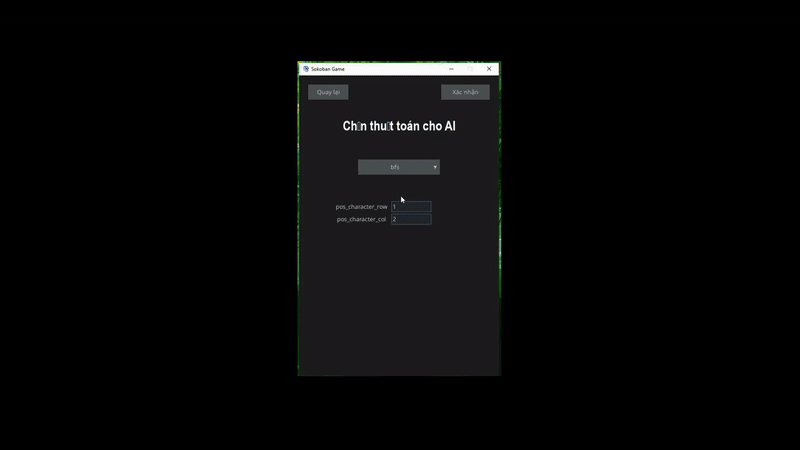
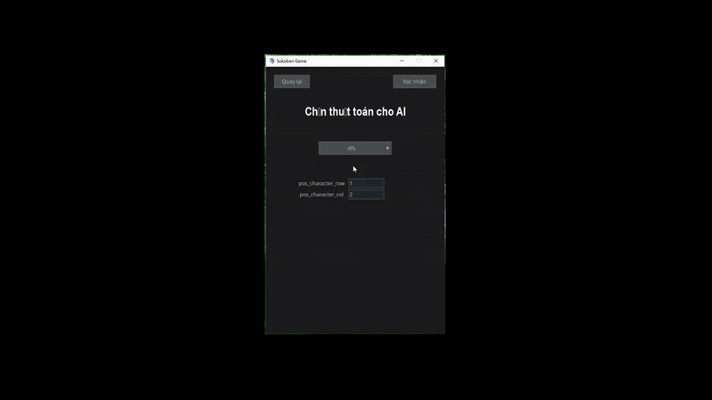
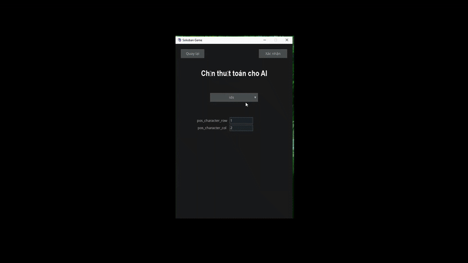
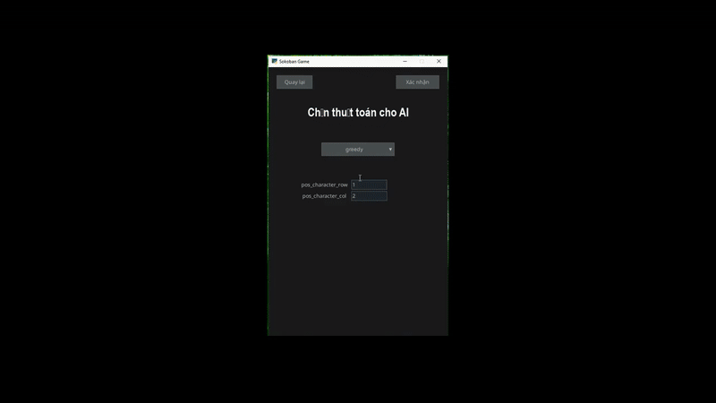
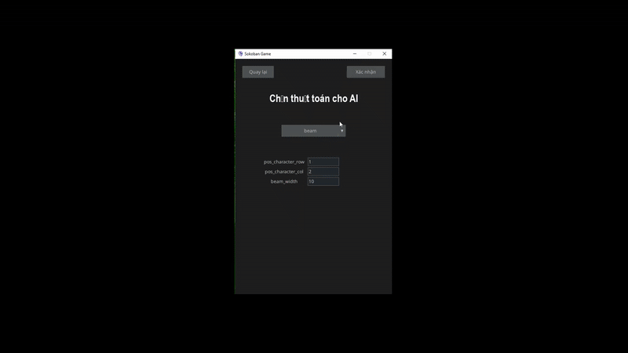
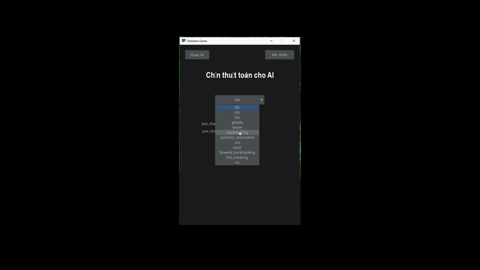
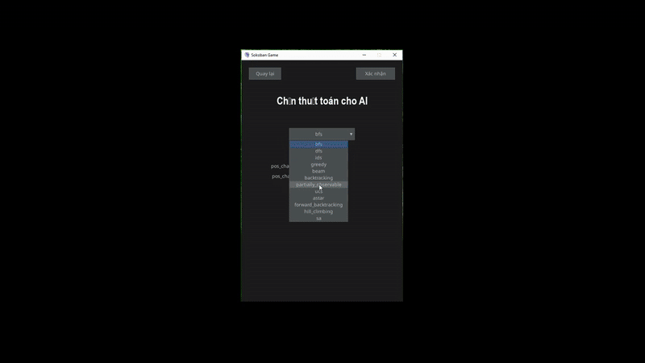
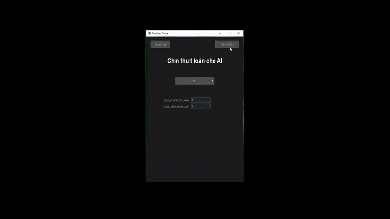
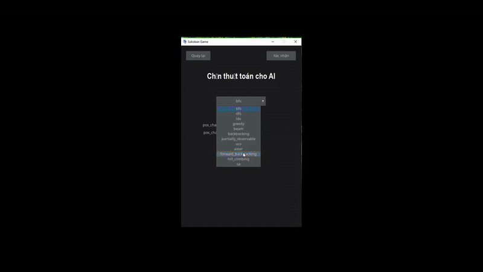
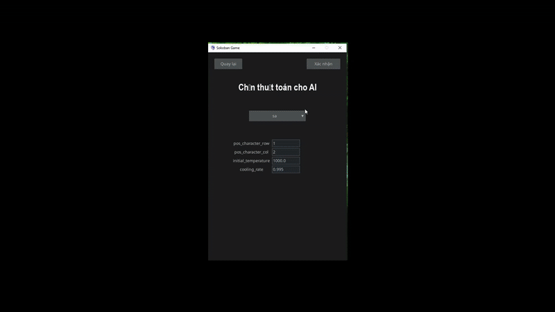

Môn Trí Tuệ Nhân Tạo (AI) - Project cuối kì

---GAME SOKOBAN---

Một trò chơi giải đố cổ điển, nơi người chơi phải đẩy các thùng vào vị trí mục tiêu trong mê cung. Trò chơi gồm 2 chế độ: người và máy. Ở chế độ người: người chơi tự chơi như game thông thường. Còn ở chế độ máy: người chơi lựa chọn các thuật toán được thiết kế sẵn, sau đó máy sẽ áp dụng thuật toán được chọn vào game để tự động giải và tự động chơi.

Dưới đây là video demo của game, gồm các thuật toán được chạy thử:

# Demo BFS

---------------------------------------------------

# Demo DFS

---------------------------------------------------

# Demo IDS

---------------------------------------------------

# Demo Greedy

---------------------------------------------------

# Demo Beam search

---------------------------------------------------

# Demo Backtracking

---------------------------------------------------

# Demo Partially Observable

---------------------------------------------------

# Demo UCS

---------------------------------------------------

# Demo A*

---------------------------------------------------

# Demo Forward Checking

---------------------------------------------------

# Demo Simulated Annealing

---------------------------------------------------

