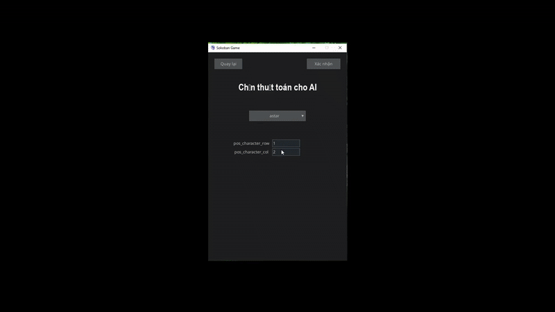
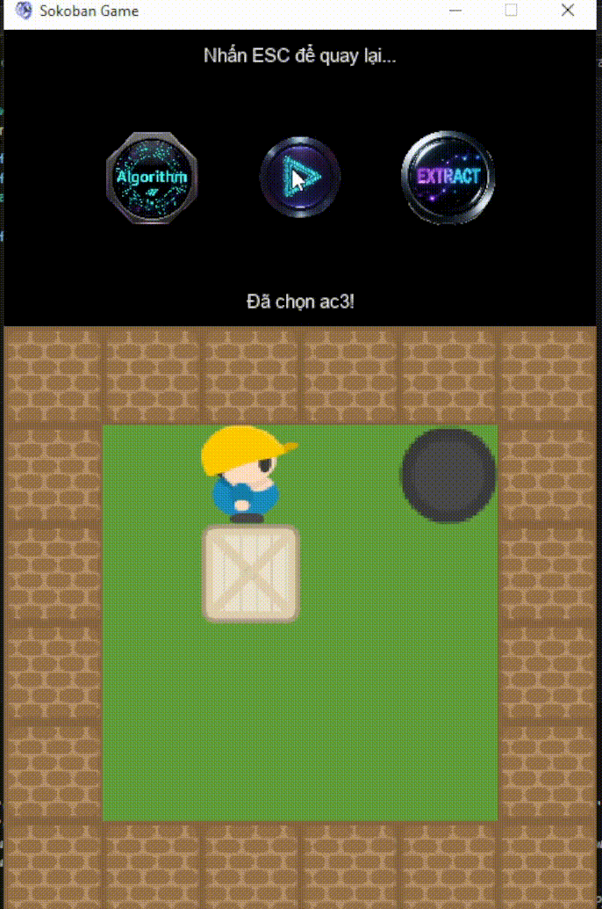

Môn Trí Tuệ Nhân Tạo (AI) - Project cuối kì

---GAME SOKOBAN---

Một trò chơi giải đố cổ điển, nơi người chơi phải đẩy các thùng vào vị trí mục tiêu trong mê cung. Trò chơi gồm 2 chế độ: người và máy. Ở chế độ người: người chơi tự chơi như game thông thường. Còn ở chế độ máy: người chơi lựa chọn các thuật toán được thiết kế sẵn, sau đó máy sẽ áp dụng thuật toán được chọn vào game để tự động giải và tự động chơi.

Dưới đây là video demo của game, gồm các thuật toán được chạy thử:

# Demo BFS

- Thuật toán sử dụng cấu trúc queue (FIFO - First in first out) để duyệt các trạng thái
- Thuật toán sẽ tìm kiếm theo chiều rộng, hay nói cách khác là sẽ duyệt toàn bộ nhánh ở cùng một độ sâu, rồi sau đó mới chuyển tới độ sâu tiếp theo.

---------------------------------------------------

# Demo DFS

- Thuật toán sử dụng cấu trúc stack (LIFO - Last in first out) để duyệt các trạng thái.
- Thuật toán sẽ đi tới node cuối cùng của một nhánh, nếu là nghiệm sẽ trả về nghiệm, không phải thì trở lại để duyệt nhánh khác.

---------------------------------------------------

# Demo IDS

- Là thuật toán kết hợp giữa BFS và DFS.
- Thuật toán thực hiện tìm kiếm toàn bộ nút ở một độ sâu, nếu không có nghiệm thì tăng độ sâu để tìm kiếm cho đến khi có nghiệm. 

---------------------------------------------------

# Demo Greedy

- Thuật toán dùng hàng đợi ưu tiên để lựa chọn bước có chi phí theo heuristic được định nghĩa là tốt nhất.
- Khác với A* có f(n) = g(n) + h(n), greedy có f(n) = h(n), tức là nó chỉ quan tâm đến hàm ước lượng chi phí đến đích.

---------------------------------------------------

# Demo Beam search

- Thuật toán về cơ bản gần giống với BFS, khác ở chỗ thay vì mở rộng tất cả các nút thì Beam search chỉ mở rộng theo k nút tốt nhất theo heuristic.

---------------------------------------------------

# Demo Backtracking

- Thuật toán tìm kiếm dựa trên việc thử và nếu sai - thì quay lại thử hướng khác.

---------------------------------------------------

# Demo Partially Observable

- Thuật toán mà agent không thể biết toàn bộ thông tin của môi trường, hay nói cách khác agent chỉ có thể biết được một phần thông tin.

---------------------------------------------------

# Demo UCS

- Là thuật toán tìm kiếm dựa trên chi phí thực tế từ trạng thái bắt đầu đến trạng thái hiện tại.

---------------------------------------------------

# Demo A*

- Thuật toán dùng f(n) để tìm hướng tốt nhất.
- f(n) = g(n) + h(n)
+ g(n): chi phí từ trạng thái bắt đầu đến trạng thái đang xét
+ h(n): chi phí từ trạng thái đang xét đến trạng thái mục tiêu
+ f(n): tổng chi phí g(n) + h(n)

---------------------------------------------------

# Demo Forward Checking

- Là kỹ thuật cải tiến của Backtracking, giúp giảm bớt các giá trị không phù hợp trước khi gán giá trị.

---------------------------------------------------

# Demo Simulated Annealing

- Thuật toán mô phỏng lại quá trình tôi kim loại.
- Thuật toán dựa trên xác suất, dùng để tránh rơi vào cực tiểu cục bộ.
- Giống như Hill-climbing, SA tìm nghiệm tốt hơn, nhưng thỉnh thoảng cố ý chấp nhận nghiệm xấu hơn để thoát khỏi cực tiểu cục bộ.

---------------------------------------------------

# Demo Hill_climbing

---------------------------------------------------

# Demo AC-3

---------------------------------------------------
